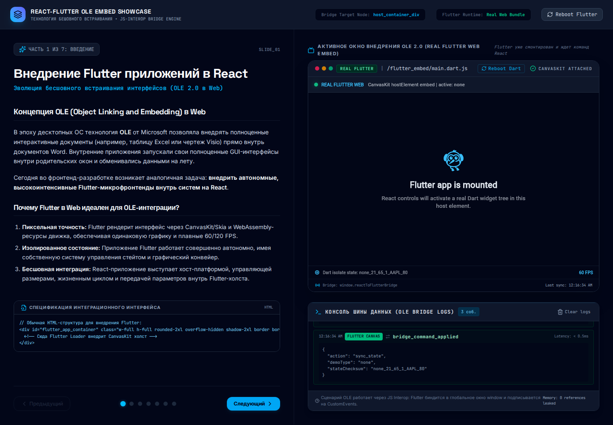
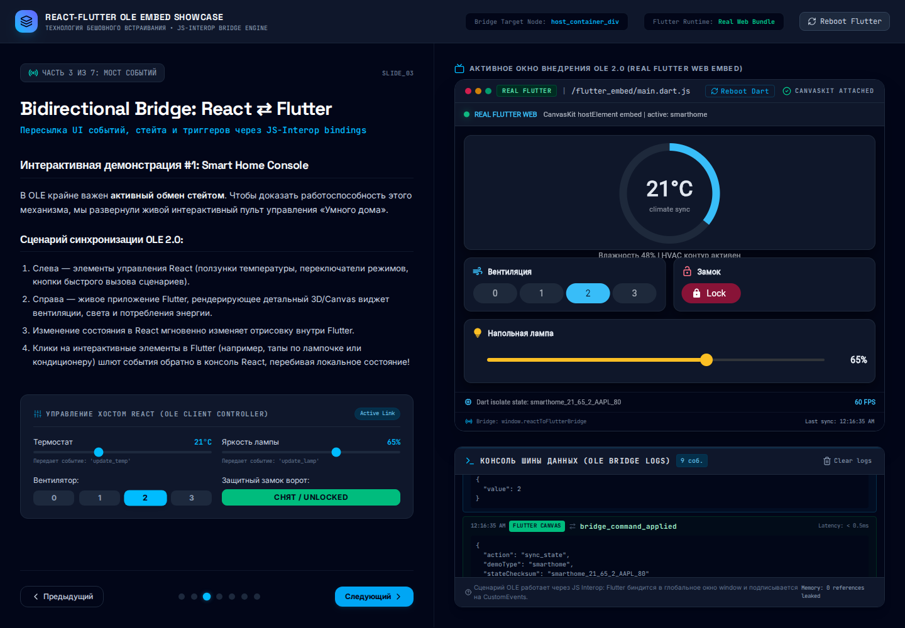
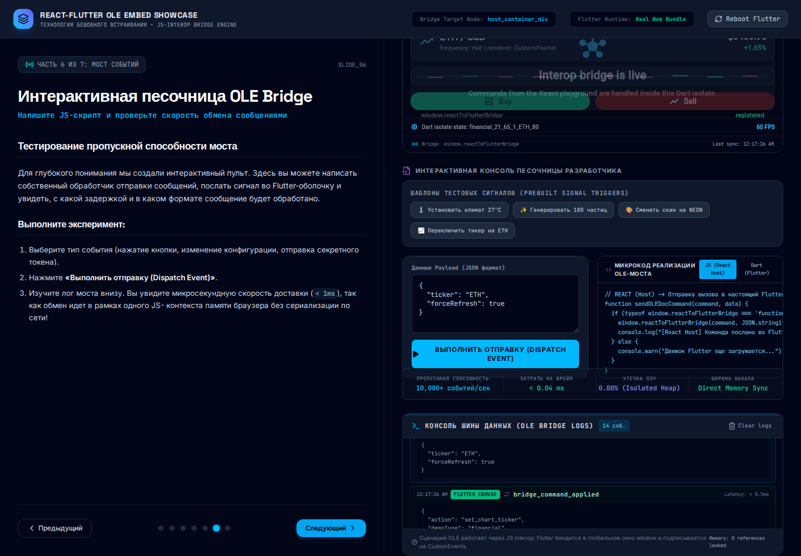

# React + Real Flutter Web Embed Showcase

Interactive React/Vite presentation that embeds a real Flutter Web application into a React host and demonstrates bidirectional JS interop between both runtimes.

The project started as a visual demo of Flutter-like widgets, but now the right-hand application is a real Flutter Web bundle built from Dart sources in [flutter_apps](flutter_apps) and served by Vite from [public/flutter_embed](public/flutter_embed). React owns the presentation, controls, logs, and host state. Flutter owns its own widget tree, CanvasKit rendering, timers, painters, and UI events.

## Screenshots

| Overview | Bidirectional bridge | Playground dispatch |
| --- | --- | --- |
|  |  |  |

## What It Demonstrates

- Real Flutter Web embedded in React without an iframe.
- CanvasKit rendering inside a host DOM element controlled by React.
- React to Flutter commands through a namespaced instance bridge at `window.__reactFlutterEmbeds.instances[instanceId]`.
- Flutter to React events through versioned JSON envelopes: `{ type, version, requestId, instanceId, payload }`.
- Shared state synchronization for smart home controls, financial ticker updates, particle demos, and custom playground commands.
- A reboot flow that resets the Dart side and then resynchronizes host state.
- Flutter Web semantics enabled so browser/manual interaction tools can see embedded controls.

## Architecture

```text
React / Vite host
   src/components/PresentationLayout.tsx
   src/components/FlutterHost.tsx
   src/components/BridgeConsole.tsx
               |
               | instance.reactToFlutter(envelopeJson)
               v
Flutter Web bundle
   flutter_apps/lib/main.dart
   flutter_apps/lib/js_bridge_web.dart
               |
               | instance.receiveFromFlutter(envelopeJson)
               v
React bridge console and host state
```

`FlutterHost` loads [public/flutter_embed/flutter_bootstrap.js](public/flutter_embed/flutter_bootstrap.js), registers an instance in `window.__reactFlutterEmbeds`, calls `window.runEmbeddedFlutter(...)`, and passes a host element to the Flutter loader. The generated Flutter runtime creates a real `<flutter-view>` inside that host element and uses CanvasKit assets from [public/flutter_embed/canvaskit](public/flutter_embed/canvaskit).

## Project Structure

```text
src/
   components/
      PresentationLayout.tsx  # slide shell, bridge state, top-level reboot
      FlutterHost.tsx         # real Flutter Web loader and host bridge
      Playground.tsx          # custom command dispatcher
      BridgeConsole.tsx       # live bridge event log
   data/slidesData.ts        # presentation copy and snippets

flutter_apps/
   lib/main.dart             # real Flutter app surfaces and command handling
   lib/js_bridge_web.dart    # Dart JS interop bridge
   web/flutter_bootstrap.js  # custom embed bootstrap

public/flutter_embed/       # generated Flutter Web release bundle
docs/screenshots/           # GitHub README screenshots
```

## Run Locally

Install Node dependencies:

```bash
npm install
```

Install or provide Flutter stable. This workspace uses a local SDK at `.flutter-sdk`:

```bash
git clone https://github.com/flutter/flutter.git -b stable .flutter-sdk
./.flutter-sdk/bin/flutter config --enable-web
./.flutter-sdk/bin/flutter --version
```

Build the embedded Flutter Web bundle:

```bash
npm run build:flutter
```

Run the React host:

```bash
npm run dev
```

Open the Vite URL shown in the terminal, usually `http://localhost:3000/`.

## Build And Checks

```bash
# TypeScript check
npm run lint

# Flutter Web bundle plus Vite production build
npm run build

# Optional Flutter-only checks
cd flutter_apps
../.flutter-sdk/bin/flutter analyze
../.flutter-sdk/bin/flutter test
```

## Bridge Contract

React sends commands into Dart:

```ts
dispatchToEmbeddedFlutter('sync_state', {
   demoType: 'smarthome',
   state: { temperature: 21, brightness: 65, fanSpeed: 2 }
});
```

Flutter emits events back to React:

```dart
emitToReact('widget_state_changed', {
   'widget': 'lock',
   'securityLocked': true
});
```

The bridge is intentionally JSON-based so the message boundary is explicit and easy to inspect in the console. Every command and event is wrapped in an envelope with `version`, `requestId`, `instanceId`, and `payload`. The app logs important commands, acknowledgements, state patches, and live ticker events in the React bridge console.

There is no global bridge fallback. Commands and events must go through the instance namespace. This showcase still runs one Flutter Web engine; the namespace makes that constraint explicit instead of pretending multi-engine embedding is already solved.

## Key Files

- [src/components/FlutterHost.tsx](src/components/FlutterHost.tsx) - loads the Flutter Web bundle and wires React/Dart bridge functions.
- [src/components/PresentationLayout.tsx](src/components/PresentationLayout.tsx) - owns slide navigation, host controls, bridge logs, and reboot behavior.
- [flutter_apps/lib/main.dart](flutter_apps/lib/main.dart) - implements the real Flutter UI surfaces and command handlers.
- [flutter_apps/web/flutter_bootstrap.js](flutter_apps/web/flutter_bootstrap.js) - wraps Flutter Web loader startup for host-element embedding.
- [docs/screenshots](docs/screenshots) - screenshots used by this README.

## Notes

- [public/flutter_embed](public/flutter_embed) is generated by `npm run build:flutter` and committed here so the React host can run immediately with the embedded runtime assets available.
- `.flutter-sdk` is intentionally ignored by git because it is a local toolchain install.
- The previous simulated Flutter component was removed. The visible Flutter area is now produced by the Dart/Flutter sources under [flutter_apps](flutter_apps).
